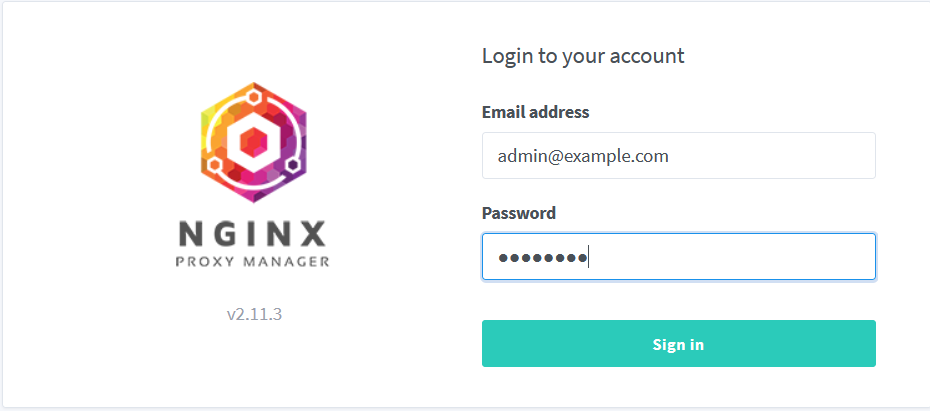

# npm-arm32v7

Nginx Proxy Manager (npm) docker works both arm32v7 and aarch64.

https://hub.docker.com/r/jc21/nginx-proxy-manager/tags

## Step by step

````
cd /opt

git clone https://github.com/primoitt83/npm-arm32v7.git

cd npm-arm32v7

docker-compose up -d
````

Go to a browser and access:
````
http://My_homeserver_IP:81

user: admin@example.com 

password: changeme

````
